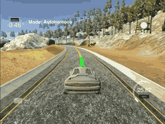

# MPC Control Project

This repository contains my solution for the project "MPC Control Project" of the Udacity Self-Driving Car Engineer Nanodegree Program. A description of a basic setup can be found in the [original repository](https://github.com/udacity/CarND-MPC-Project). The written code could be found in the files [main.cpp](./src/main.cpp)an  [MPC.cpp](./src/MPC.cpp).

The following part of the README contains a short writeup which describes what is done.

---

In this project a MPC controller is implemented to drive a car around a track in a simulator. There are waypoints given on which the car should drive. Based on these the controller should output a steering angle and the throttle for the driving.

In the file [MPC.cpp](./src/MPC.cpp) the MPC controller is implemented. It it based on a model of the car consisting of a state, its actuators and equations for the state updates. The update equations are implemented in [MPC.cpp](./src/MPC.cpp) on the lines `150-155`. The state of the car consists of its `x` and `y` position, its steering angle `psi`, the speed `v`, the CTE error and the error of the steering angle. The actuators are the steering angle and the throttle of the car.

The MPC controller takes such a state and tries to find the best values for the actuators with respect to a cost function and the update equations. It tries to predict the future states using the parameters `N` and `dt` which describe how many time steps (`N`) the MPC should predict the future and how big these time steps are (`dt`).

Based on these parameters a cost function is minimized. While the implementation of the MPC itself is quite straightforward the selection of the cost function give much room for improvement of the MPC.

Basically the cost function could be split into three parts. Minimizing the error in the state, the use of the actuators and the change of the actuators. The first improvement over just summing these costs up is to use weights for each one and the just search for good weights to get a good cost function. With these weights the importance of each cost on the total cost can be represented.

A second improvement is to set the costs in proportion to each other. For example the steering should be minimized because we do not want to steer when it is not needed. But just summing up the steering and add it to the cost would just result in less steering and so prevent the car to drive through sharp curves. A better way is to divide the steering by the CTE error and then add it to the cost. Thus we do not steer if the CTE is already simple because the cost for steering grows with a lower CTE. If the CTE is high we are not on track so we have to steer high and with a high CTE the cost for steering goes down. The same applies to the change of the steering angle.

Lastly using the mean over the actuators instead just the differences between sequential actions results in a way more smooth driving.

The cost function is implemented in [MPC.cpp](./src/MPC.cpp) on the lines `80-113`.

Because in a real car there is some lag between the output of the controller and the actual change of the actuators in the simulation some lag of 100ms is added. To involve this in the MPC we calculate the state in which we would be after the lag and then use the MPC on this state. This happens in [main.cpp](./src/main.cpp).

The results of the MPC on driving thought the track are really good compared to the previous use of a PID controller.

Setting the speed at which the car should drive to 30 mph the result is a smooth driving. The following GIF shows that.

Going up with the speed to 60 mph  still results in a smooth and save driving around the track.

At a fixed speed of 80 mph the MPC comes to its limits. It is still able to drive on the track but it starts to wiggle after some curves manly because of the lag.

Using a more dynamic speeding so that the car slows down on the curves the MPC is able to go up to 100 mph on the straight parts of the track and then slowing down to about 60 mph in the curves.

# Build & Run

### Dependencies

* cmake >= 3.5
* make >= 4.1 (Linux, Mac), 3.81 (Windows)
* gcc/g++ >= 5.4

### Basic Build Instructions

1. Clone this repo.
2. Make a build directory: `mkdir build && cd build`
3. Compile: `cmake .. && make`
4. Run it: `./mpc`
